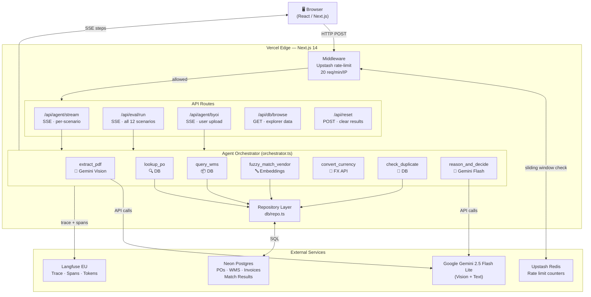

# FastPay AI — Autonomous 3-Way Invoice Reconciliation

> An agentic AI **Accounts Payable (AP)** back-office worker that reads messy vendor invoices, cross-references them against Purchase Orders and Warehouse Receipts, and autonomously approves or flags them — with reasoning, confidence scores, and full traceability.

**[Live Demo → fastpay-ai.mezapps.com](https://fastpay-ai.mezapps.com)**

A learning side project exploring real-world **agentic workflows**, **document AI**, **LLM evaluation**, and **production-grade agent observability** — applied to a genuine supply chain pain point.

---

## Table of Contents

- [The Problem](#the-problem)
- [The Vision](#the-vision)
- [Tech Stack](#tech-stack)
- [Architecture](#architecture)
- [Feature Set](#feature-set)
- [The Invoice Gallery](#the-invoice-gallery)
- [UI Layout](#ui-layout)
- [Cost & Abuse Protection](#cost--abuse-protection)
- [Security & Workflow Rules](#security--workflow-rules)
- [Project Roadmap & Progress](#project-roadmap--progress)
- [Local Development](#local-development)

---

## The Problem

**3-Way Matching** is one of the most universally painful processes in **Accounts Payable (AP)** and supply chain operations. Every day, AP clerks manually cross-reference three documents for every single vendor invoice:

1. **Purchase Order (PO)** — what was ordered, at what price
2. **Warehouse Receipt (WMS)** — what physically arrived at the dock
3. **Vendor Invoice** — what the vendor is billing for

Mismatches (shortages, price gouging, duplicate billing, unauthorized line items, currency drift) must be caught manually. Enterprise AP teams spend thousands of hours per month on this. It's slow, error-prone, and a perfect fit for an autonomous agent.

## The Vision

Build a working MVP of an **autonomous Accounts Payable (AP) back-office agent** that can:

- Ingest messy, real-world invoice PDFs (scans, photos, multi-line, foreign currency)
- Extract structured data using a vision LLM
- Use tools to query PO and WMS data sources
- Apply fuzzy matching for vendor and SKU mismatches
- Make a deterministic approve/flag/escalate decision
- Generate a natural-language explanation with a confidence score
- Surface a full evaluation dashboard proving the agent's reliability
- Be fully observable — every step, every tool call, every token cost traced

The end product is **frictionless**: a recruiter, hiring manager, or curious visitor lands on the page, clicks one button, and watches an agent reason through a batch of real invoices in real time.

---

## Tech Stack

| Layer | Choice | Why |
|---|---|---|
| **Framework** | Next.js 14 (App Router) | Full-stack React in one repo; Vercel-native deployment |
| **Language** | TypeScript | Type safety for agent state, tool schemas, matching logic |
| **Styling** | Tailwind CSS + shadcn/ui | Clean, professional dashboard aesthetic with zero cost |
| **Database** | SQLite (`better-sqlite3`) → Neon Postgres | $0 locally; one env-var flip to scale to enterprise |
| **AI Model** | Google **Gemini 2.5 Flash Lite** | Generous free tier; vision-capable; fast |
| **PDF Vision Extraction** | Gemini multimodal | Native PDF + image understanding |
| **Embeddings** | Gemini `gemini-embedding-001` | Fuzzy vendor and SKU matching |
| **Agent Observability** | Langfuse (free tier) | Trace every step, tool call, token, latency |
| **Rate Limiting** | Upstash Redis (free tier) | IP-based throttling at the edge |
| **Animation** | Framer Motion | Smooth trace reveal, batch processing animation |
| **Deployment** | Vercel (free tier) | Zero-config for Next.js |

**Total monthly cost at launch: $0.00**

---

## Architecture



### Design principles

- **Repository pattern** — every DB call goes through a repo interface; swapping SQLite for Postgres is one config line.
- **Tool-using agent** — the LLM never has direct DB access; it calls typed tools whose outputs are validated.
- **Structured outputs everywhere** — Zod schemas validate every LLM response.
- **Streaming traces** — agent steps stream to the UI via Server-Sent Events for the live "thinking" effect.
- **Frugal-by-default, scalable-by-design** — every component has a documented upgrade path.

---

## Feature Set

### Core Agentic Capabilities

- **Vision-based PDF extraction** — handles digital PDFs, scans, phone photos, handwritten annotations
- **Tool-using agent loop** — extract → lookup → query → fuzzy-match → convert → reason → decide → escalate
- **Fuzzy vendor & SKU matching** via embeddings + cosine similarity
- **Currency conversion** tool with cached FX rates
- **Duplicate invoice detection** (fraud prevention)
- **Confidence scoring** with calibration
- **Human-in-the-loop escalation** for low-confidence cases
- **Natural language reasoning** for every decision
- **BYOI (Bring Your Own Invoice)** — upload any real invoice; a synthetic PO + WMS is generated with one injected discrepancy for the agent to find

### Decision Logic (Deterministic Rules + LLM Reasoning)

| Condition | Status |
|---|---|
| All quantities and prices match across PO/WMS/Invoice | **APPROVED** |
| WMS qty < Invoice qty | **FLAGGED — SHORTAGE** |
| Invoice price > PO price | **FLAGGED — PRICE MISMATCH** |
| Vendor name doesn't match PO vendor (fuzzy threshold) | **FLAGGED — VENDOR MISMATCH** |
| Currency differs and conversion needed | **FLAGGED — FX CONVERSION** |
| Invoice line items not in PO | **FLAGGED — UNAUTHORIZED ITEMS** |
| Hash matches a previously processed invoice | **FLAGGED — DUPLICATE** |
| Tax totals don't match line-item arithmetic | **FLAGGED — TAX MISMATCH** |
| Confidence < threshold | **ESCALATED — HUMAN REVIEW** |

### UI Views

| View | Description |
|---|---|
| **Gallery** | 12 invoice cards with thumbnails, difficulty badges, skill tags, download links. Click any card to run the agent live. |
| **Eval Mode** | Benchmark all 12 scenarios against ground-truth labels. Streams per-scenario results; computes accuracy, macro F1, per-class precision/recall, confusion matrix, p50/p95 latency. |
| **Database Explorer** | Browse all POs, WMS receipts, and invoices directly — ERP-style header/detail rows showing each line item. Invoices tab highlights the specific impacted SKUs (⚠) for non-approved decisions. |
| **Escalations** | Deep-dive view of every FLAGGED and ESCALATED invoice. Shows flag reason, agent explanation, confidence, and per-line-item breakdown with impacted SKUs highlighted in red. |

---

## The Invoice Gallery

12 hand-crafted, real-looking PDF invoices — each designed to test a specific agent capability. POs and WMS receipts have **1–3 line items** each for realistic multi-SKU matching.

| # | Scenario | Skill | Expected |
|---|---|---|---|
| 1 | Clean digital PDF, all matches | Baseline happy path | APPROVED |
| 2 | Phone-photo of invoice | Vision OCR resilience | APPROVED |
| 3 | "ACME Corp." vs "Acme Corporation" | Fuzzy vendor matching | APPROVED |
| 4 | Partial shortage on monitored SKU | Multi-line reasoning | FLAGGED — SHORTAGE |
| 5 | EUR invoice against USD PO | FX conversion + price check | FLAGGED — FX / PRICE |
| 6 | Handwritten discount annotation | Vision + judgment | ESCALATED |
| 7 | Duplicate of a previously paid invoice | Fraud / duplicate detection | FLAGGED — DUPLICATE |
| 8 | Vendor billed for SKUs not on PO | Unauthorized line detection | FLAGGED — UNAUTHORIZED |
| 9 | Tax rate 12% on 8% PO | Arithmetic / tax reasoning | FLAGGED — TAX MISMATCH |
| 10 | Price 10% above agreed PO rate | Price gouging detection | FLAGGED — PRICE MISMATCH |
| 11 | Near-identical vendor name (typo fraud) | Anti-fraud fuzzy logic | ESCALATED |
| 12 | Perfect match, late delivery note | Timeliness check | APPROVED |

Each invoice PDF has a corresponding PO and WMS receipt seeded in the database. All scenario data lives in `data/scenarios.json` — the single source of truth for seeding, rendering, and eval ground-truth labels.

---

## UI Layout

```
┌─────────────────────────────────────────────────────────────────────────┐
│  FastPay AI  ·  Autonomous 3-Way Invoice Reconciliation      How it works│
├─────────────────────────────────────────────────────────────────────────┤
│  Click any invoice to process it, or run the full batch at once.        │
│  [Explore Database] [Escalations] [Eval Mode] [Reset Results]           │
│  [Upload Invoice]   [▶ Process Today's Batch]                           │
├─────────────────────────────────────────────────────────────────────────┤
│  INVOICE GALLERY                          1/12 processed  ↓ Download All│
│  ┌──────┐ ┌──────┐ ┌──────┐ ┌──────┐ ┌──────┐ ┌──────┐               │
│  │ PDF  │ │ PDF  │ │ PDF  │ │ PDF  │ │ PDF  │ │ PDF  │  ← thumbnails  │
│  │Easy  │ │OCR   │ │Fuzzy │ │Short │ │FX    │ │Hand  │  ← skill tags  │
│  │  ✓  │ │  ✗  │ │  ✓  │ │  ✓  │ │  ✓  │ │  ⏳ │  ← result dots │
│  └──────┘ └──────┘ └──────┘ └──────┘ └──────┘ └──────┘               │
├─────────────────────────────────────────────────────────────────────────┤
│  Agent Trace (live SSE)       │  Decision Output                        │
│  ▸ load_invoice()       ✓    │  Status: FLAGGED                        │
│  ▸ check_duplicate()    ✓    │  Confidence: 97%                        │
│  ▸ extract_pdf()        ✓    │  Flag: PRICE_MISMATCH                   │
│  ▸ lookup_po(PO-0004)   ✓    │                                         │
│  ▸ query_wms(PO-0004)   ✓    │  Invoice billed $495/unit for DSK-STD   │
│  ▸ fuzzy_match_vendor() ✓    │  but PO agreed $450/unit — 10% above    │
│  ▸ reason_and_decide()  ⏳   │  contracted rate.  [View Trace ↗]       │
└─────────────────────────────────────────────────────────────────────────┘
```

### The "Wow" Moments

1. **Live batch processing** — "Process Today's Batch" runs all 12 invoices sequentially with per-step SSE trace, decisions populating in real time, and running totals (approved/flagged/escalated) in the ActionBar.
2. **Eval Mode** — benchmarks the agent against ground-truth labels and streams per-scenario pass/fail with a full confusion matrix, F1 scores, and latency percentiles.
3. **Escalations view** — mirrors what an AP manager's review queue looks like: every flagged invoice with the exact SKU responsible highlighted, the agent's reasoning, and the confidence score.
4. **Database Explorer** — an ERP-style browse of every PO, WMS receipt, and invoice in the system, showing which specific line items triggered a flag.
5. **Bring Your Own Invoice** — upload any real invoice PDF/image; a synthetic PO + WMS is generated with one injected discrepancy, then the full agent pipeline runs and explains what it found.

---

## Cost & Abuse Protection

### Layered defenses

| Layer | Mechanism | Effect |
|---|---|---|
| **1. Response caching** | Match results stored in DB keyed by invoice_id | Repeat requests cost $0 after first run |
| **2. Input locking** | API rejects unknown scenario IDs or oversized uploads | Blocks prompt injection and runaway-token attacks |
| **3. IP rate limiting** | Upstash Redis: 20 req/min/IP | Throttles abuse at the edge |
| **4. Vercel Edge Middleware** | Rate limit fires before serverless wakes up | Zero compute cost on blocked requests |
| **5. Daily budget guard** | `MAX_DAILY_RUNS` hard cap (default 100 ≈ $0.30/day) | Catastrophic-failure safeguard |
| **6. Upload validation** | File size ≤ 10 MB, MIME must be PDF/JPEG/PNG/WEBP | Blocks abusive uploads |
| **7. No secrets in client** | All LLM calls happen server-side only | API keys never reach the browser |
| **8. BYOI file cleanup** | Uploaded files written to `/tmp` and deleted after processing | No accumulation on filesystem |

---

## Security & Workflow Rules

- **No secrets in git.** Every commit is preceded by a sweep for API keys. `.env*` is gitignored from day one.
- **All LLM I/O validated with Zod schemas.** No unchecked JSON parsing.
- **Server-side LLM calls only.** Client never holds an API key.
- **Parameterized DB queries only.** No string-concatenated SQL.
- **No destructive git operations without confirmation.**

---

## Project Roadmap & Progress

### Phase 0 — Foundation ✅
- [x] Next.js 14 + TypeScript + Tailwind + shadcn/ui
- [x] SQLite + repository pattern abstraction (dual-mode: SQLite dev / Neon prod)
- [x] Core data schemas (PO, WMS Receipt, Invoice, Match Result) with Zod

### Phase 1 — Static UI Skeleton ✅
- [x] ActionBar with navigation buttons
- [x] Invoice gallery grid with difficulty badges + skill tags
- [x] Agent trace panel and decision output panel

### Phase 2 — Synthetic Data Pipeline ✅
- [x] 12-scenario JSON file (`data/scenarios.json`) — single source of truth for seeding, rendering, and eval
- [x] 5 HTML invoice templates with SVG vendor logos (Apex, Northwind, EuroTech, Crestline, Generic)
- [x] Puppeteer rendering: HTML → PNG → PDF
- [x] `sharp` post-processing: scanned, phone-photo, handwritten, crumpled variants
- [x] Seed script (`npm run seed`) — renders PDFs + inserts all records
- [x] Multi-line POs: 1–3 line items per scenario for realistic matching

### Phase 3 — Agent Tools ✅
- [x] `extract_pdf` — Gemini vision with Zod validation
- [x] `lookup_po` + `query_wms` — typed DB tool calls
- [x] `fuzzy_match_vendor` — embeddings + cosine similarity
- [x] `convert_currency` — FX rate with 6h cache
- [x] `check_duplicate` — invoice_number-based fraud detection
- [x] `reason_and_decide` — deterministic rule engine + Gemini explanation
- [x] Full orchestrator loop with SSE trace streaming

### Phase 4 — SSE Streaming & Observability ✅
- [x] `/api/agent/stream` — per-step SSE endpoint
- [x] Langfuse integration — optional; per-run traces with spans
- [x] `trace_id` stored in match_results for deep-link in UI

### Phase 5 — Live UI Integration ✅
- [x] Gallery card click → real agent run via SSE
- [x] Live trace panel with in-place step updates
- [x] Decision panel with status badge, confidence bar, reasoning, latency
- [x] "Process Today's Batch" with live approved/flagged/escalated counters

### Phase 6 — Eval Mode ✅
- [x] `/api/eval/run` — SSE eval endpoint, runs all 12 scenarios fresh
- [x] Full metrics: accuracy, macro F1, per-class P/R/F1, confusion matrix, p50/p95 latency
- [x] Per-scenario pass/fail table with "expected / got" labels for mismatches
- [x] Skip detection: scenarios missing from DB show amber warning instead of silent dash
- [x] Eval fallback lookup: uses `invoice_number` when `scenario_id` lookup fails

### Phase 7 — Polish & Wow Factor ✅
- [x] Real invoice thumbnails in gallery cards (Puppeteer crop → JPEG)
- [x] Framer Motion animations on trace steps and decision reveal
- [x] Langfuse trace deep-link in result panel
- [x] **Bring Your Own Invoice** — modal upload; synthetic PO+WMS with injected discrepancy
- [x] BYOI bug fix: orchestrator skips PDF re-extraction for BYOI invoices, uses stored data and correct synthetic PO reference so injected discrepancy is always what the agent flags
- [x] PDF download on each gallery card + "Download All" button

### Phase 8 — Abuse Protection, CI/CD & Deployment ✅
- [x] Upstash Redis rate limiting — sliding window 20 req/min/IP
- [x] Daily budget guard — `MAX_DAILY_RUNS` env var
- [x] BYOI uploads to `/tmp` (Vercel read-only filesystem fix)
- [x] GitHub Actions CI — lint + tsc + build on every push
- [x] Vercel auto-deploy on merge to `master`
- [x] Live at [fastpay-ai.mezapps.com](https://fastpay-ai.mezapps.com)

### Phase 9 — Database Explorer & Escalations ✅
- [x] **Database Explorer** — `/api/db/browse` endpoint + ERP-style UI; browse POs, WMS receipts, invoices with header/detail rows per line item
- [x] **Impacted SKU highlighting** — non-approved invoices show a `⚠` badge on the specific line items responsible for the flag (PRICE_MISMATCH, SHORTAGE, UNAUTHORIZED_ITEMS)
- [x] **Escalations view** — dedicated tab showing all FLAGGED/ESCALATED invoices with flag reason, confidence, agent explanation, and impacted SKU detail
- [x] **Reset Results** button — clears all match results and invoice statuses from DB
- [x] Full font color audit — all near-invisible `zinc-600`/`zinc-700` text bumped to legible `zinc-400`/`zinc-500` across every component

### Phase 10 — UI Consolidation ✅
- [x] Removed duplicate tab strip (Gallery / Eval / Explore / Escalations were shown twice)
- [x] Single ActionBar as the sole navigation surface
- [x] Upload Invoice repositioned to just before Process Today's Batch

---

## Local Development

```bash
# clone
git clone https://github.com/manumezog/3Way-InvoiceMatching-Agent.git
cd 3Way-InvoiceMatching-Agent

# install
npm install

# environment
cp .env.example .env.local
# edit .env.local — see table below

# seed the database + generate PDFs
npm run seed

# dev server
npm run dev
```

Open [http://localhost:3000](http://localhost:3000).

### Environment variables

| Variable | Required | Notes |
|---|---|---|
| `GEMINI_API_KEY` | ✅ Yes | Google AI Studio → API Keys |
| `DATABASE_URL` | Optional | Leave blank for local SQLite. Set to a `postgresql://` Neon connection string for Postgres. |
| `LANGFUSE_PUBLIC_KEY` | Optional | Langfuse project → Settings → API Keys |
| `LANGFUSE_SECRET_KEY` | Optional | Same as above |
| `LANGFUSE_BASE_URL` | Optional | `https://cloud.langfuse.com` (US) or `https://eu.cloud.langfuse.com` (EU). Must match the region your project was created in — the trace deep-link uses this value. |
| `UPSTASH_REDIS_REST_URL` | Optional | Upstash console → REST URL. Rate limiting is a no-op when absent. |
| `UPSTASH_REDIS_REST_TOKEN` | Optional | Same as above |
| `MAX_DAILY_RUNS` | Optional | Default `100`. Hard cap on total agent runs per day across all users. |

> **Langfuse region:** If your Langfuse project is in EU, set `LANGFUSE_BASE_URL=https://eu.cloud.langfuse.com`. The wrong region sends traces correctly but makes the in-app deep-link point at the wrong server.

### Database options

**Local SQLite (default):** Leave `DATABASE_URL` unset. `npm run seed` creates `data/fastpay.db` and inserts all records. Zero config.

**Neon Postgres (production):** Create a Neon project, copy the pooled connection string, set it as `DATABASE_URL`. Run `npm run seed` — it auto-detects Postgres, creates the schema, and inserts all 12 scenarios.

### Seeding notes

- `npm run seed` clears existing data, re-renders all 12 invoice PDFs via Puppeteer, and re-inserts every record. Safe to re-run.
- PDFs land in `public/invoices/` and thumbnails in `public/thumbnails/`. Both are committed to git so Vercel can serve them as static files without a build-time seed step.
- BYOI uploads are written to `/tmp` and deleted after each request — they are ephemeral and never committed.
- **PDF regeneration cannot run on Vercel** (requires headless Chromium + write access to `public/`). Run `npm run seed` locally and commit the updated PDFs when scenario data changes.

---

## License

MIT.
